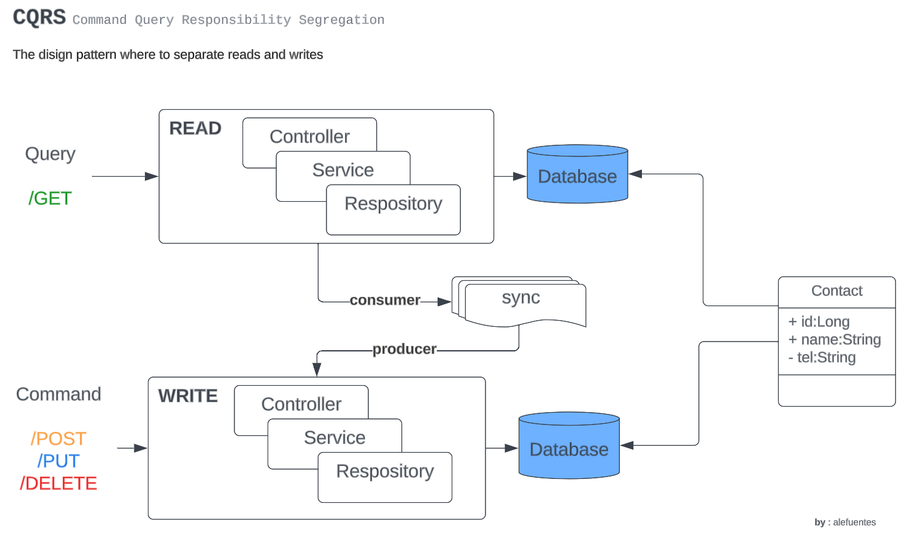

# Intro to Pattern :: CQRS


Hi guys, in this project that use how to example for see CQRS pattern, I create two microservices where one has a function how to Command, and other how to Query.

> **NOTA**: This project no use many other aspect to consider, such as security, concurrency, data consistence, on so on. 
> 
> This project is only how to testing. CQRS is a pattern help us separate own system in write and read, but their precise implementation depend on the complexity and specific requirements of the system.

## the Project


This project has two microservices, where one is a **Command**, and other the **Query**. Each has own database. 
To synchronize the database, the microservices use the Kafka broker.

**Microservice Command**

In this service, the system add/edit contact in our DB.
Here set to the system how to producer one message to Kafka.

**Microservice Query**

In this service, the system read the DB. 
Here set the system how to consumer of kafka.



## Resources for use this example


> Note: when execute docker cmd, make sure to start Docker Desktop.

For execute resource of database and Kafka environment, can be use to docker compose files:

```bash
# For create MySql database
docker-compose -f dc-mysql-container.yml up --build -d

# for create Kafka broker
docker-compose -f dc-kafka-container.yml up --build -d
 
# after started, we can see its health in cmd
docker ps
```

### stop container
For stop all container the use in in this tutorial, can be type in CMD:
```bash
# for see our containers, where I get the names of container
docker ps

# for stop, use name of container listing in previous step.
docker stop <name-container-1> 
docker stop <name-container-2> 
#...on so on

# after it, for see if container is stopped
docker ps
CONTAINER ID   IMAGE     COMMAND   CREATED   STATUS    PORTS     NAMES

```